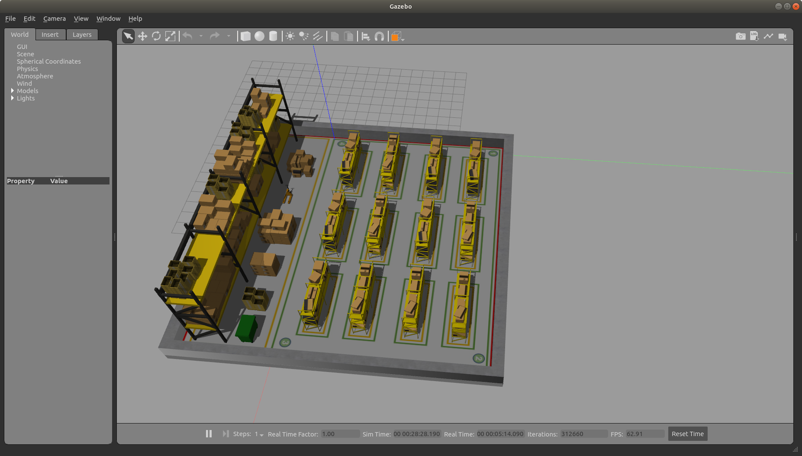
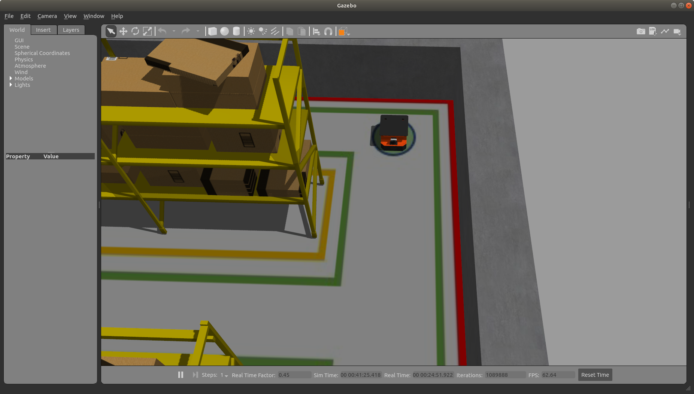

# Gazebo-ROS多智能体协同仿真实践
Multi-agent simulation platform

## 使用说明

在把所有文件拷贝下来之后，首先需要在catkin_ws文件夹下执行catkin_make进行编译。（在编译前可以删除以前的devel和build文件夹，防止意外问题）然后**一定不要忘记source devel文件夹下的setup.bash**

### robot_test包
运行代码：
``` shell
roslaunch robot_test robot.launch
```

### volta文件夹

这个包是ROS官网中所列举的使用ROS的一个机器人，这个包下有很多ROS包，每个包都有自己的作用，使用时基本不用对其进行修改。具体每个包的作用可以参考ROS官网对[volta机器人的介绍](http://wiki.ros.org/Robots/Volta)。

### multi_agent_system文件夹

这个文件下有一个warehouse_building包。里面包含了一个仿真环境。world下的warehouse.world就是一个仓库模型。但是想把仓库模型完全展示出来，使用前需要先将model中的模型文件存放在gazebo的模型文件夹中 一般路径是~/.gazebo/models。**注意要把显示隐藏文件打开才能看到.gazebo**。

### 场景加载

在shell中执行命令
``` 
roslaunch warehouse_build gazebo.launch 
```
查看模型是否加载正确。如果加载正确的话应该类似于下面的界面



### 机器人加载(不要关闭gazebo)

在shell中执行命令
```shell
 roslaunch warehouse_build simulation.launch 
```

这个launch文件主要用来将四个volta机器人加载到场景中。在场景地面上有四个数字，分别对应volta机器人的编号，所有的机器人tf前缀或者别的前缀都是 volta+各自编号 如volta1。如果加载成功应该是有四个下图所示的机器人。



**如果上述执行都没有问题的话以后可以执行下面的命令启动全部仿真环境**

```shell
 roslaunch warehouse_build experiment.launch 
```

### 机器人控制

在启动场景和机器人之后，可以选择自己想要控制的机器人。控制机器人有两种方式。

* 用键盘控制

通过更改volta后面的编号可以选择要控制的机器人，但要注意每次控制一个机器人。如果没有添加后面的赋值语句则默认用程序控制。

```shell
roslaunch warehouse_build teleop.launch volta2:=true
```

执行完成后可以通过下面的键盘来进行控制移动

   u(左前进)    i(前进)    o(右前进)

   j(左旋转)    k(停止)    l(右旋转)

   m(左后退)    ,(后退)    .(右后退)

q/z : 增大/减少10%最大速度

w/x : 增大/减少10%线速度

e/c : 增大/减少10%角速度

* 程序控制

程序控制只需要执行

```shell
roslaunch warehouse_build teleop.launch 
```

这种方式需要自己编写程序在主题cmd_vel1,cmd_vel2,cmd_vel3或cmd_vel4主题上发布类型为``geometry_msgs/Twist Message``的消息。根据消息内的格式就能控制相应编号的机器人移动。


